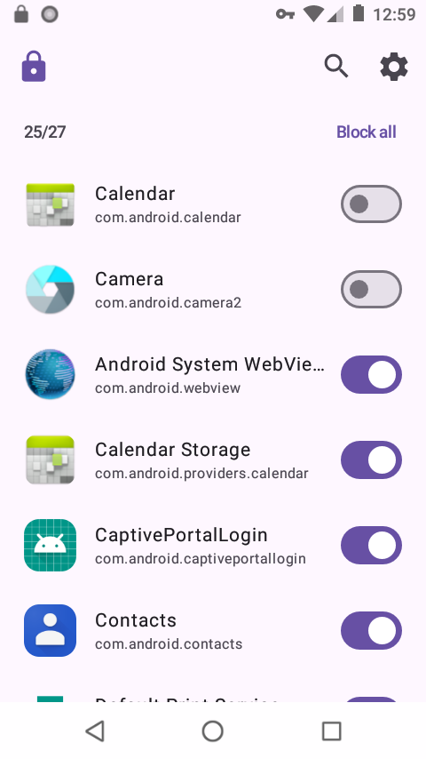
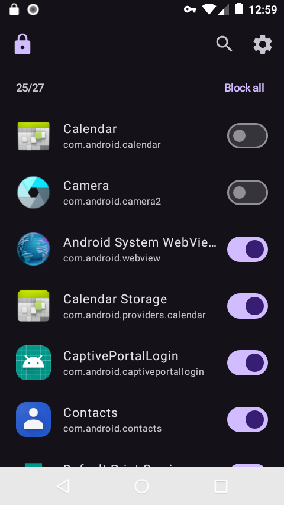
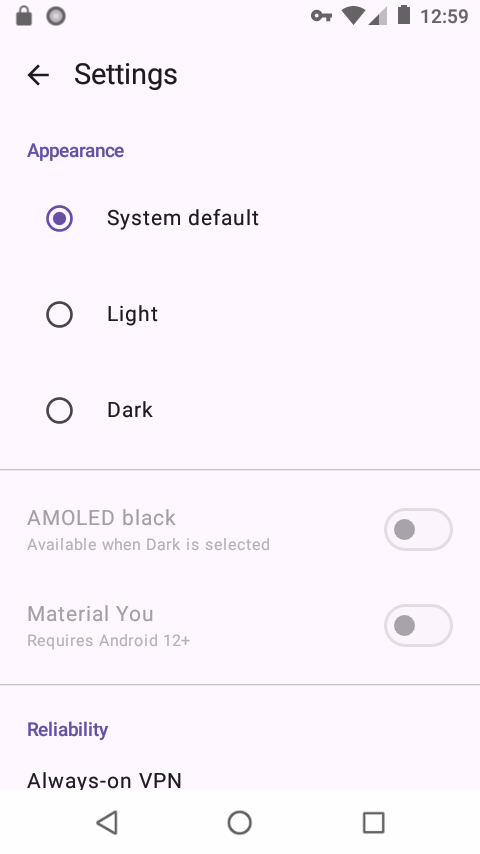
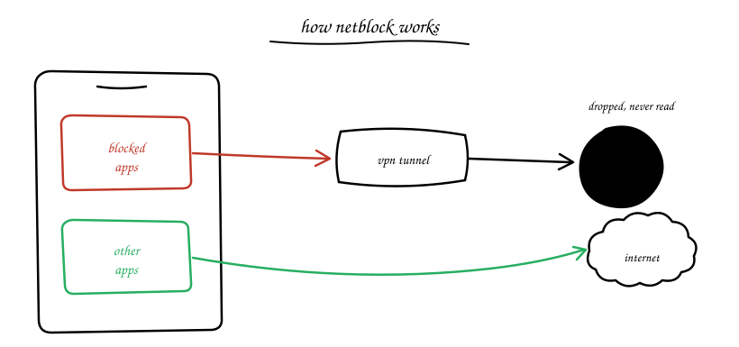

<h1 align="center">Netblock</h1>

An experimental attempt to make yet another VPN-based "firewall" for Android without root access.
The main motivation is to have a simple approach and a clean UI.

## Screenshots

| Blocking apps | Dark theme | Settings |
|:---:|:---:|:---:|
|  |  |  |

## How it works

Android's `VpnService` can route selected apps through a VPN tunnel, so the kernel drops the
blocked apps' packets; everything else keeps going through.

## Compared to NetGuard

[NetGuard](https://github.com/M66B/NetGuard) is the mature project here, and if you want
per-network rules, traffic logs, or hosts-based ad blocking, use it — genuinely. Netblock exists
to embrace simplicity and to do one thing and do it well.

## Install

Needs Android 8.0 or newer. Grab the APK matching your device architecture from the
[releases page](https://github.com/j0d3v/netblock/releases) — `arm64-v8a` for most modern
devices, or `-universal.apk` as a fallback if you're not sure.
On first launch the app walks you through the needed permissions.

## AI use disclosure

I'm not going to pretend I've made this app entirely by hand, but I used AI to scaffold the boring
parts, brainstorm, and iterate.

## License

[GPL-3.0](LICENSE) © j0d3v
